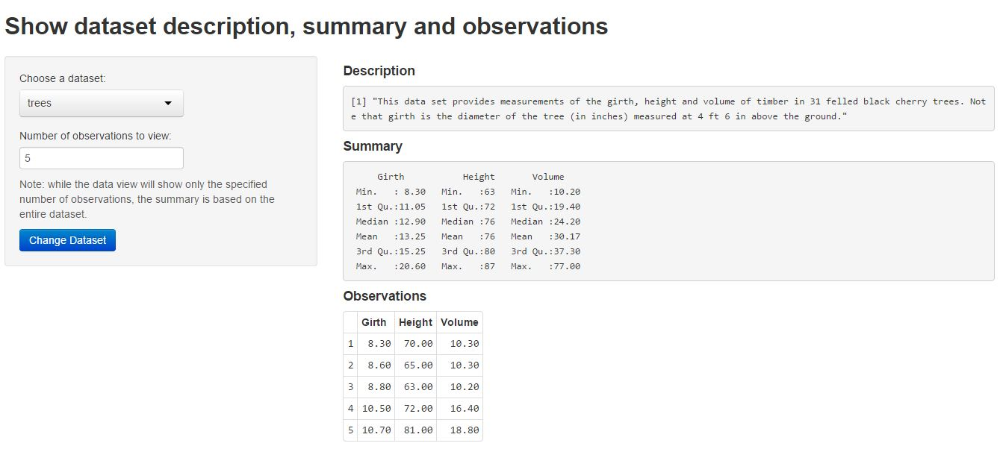

## Introduction to a Simply Shiny Prototype
 
 
__Goal: Preview datasets in library(dataset) easily:__
 
 + Select R library dataset easily with English-like phrases
 
 + Choose how many observations in the selected dataset to view
 
 + Display description and a quick summary of the selected dataset
 
 + No need to remember / learn R
 

---
 
## Clean and Easy to Use Interface




---
 

## How does it help non-R users?

 By typing _library(help=datasets)_ at R command line, you will see a full 
 list of datasets in the library. However, it's be inconvenient for non-R users 
 to install the software, learn R and type the commands to view the datasets in 
 R. An example is __head(anscombe, 5)__. It's intimidating, isn't it?
 
```{r}
head(anscombe,5)

```

---
 

## Future Developments
 
We planned to include these new features: 
 
+ Dynamically list all datasets in dataset library 
 
+ Select columns of each dataset 
 
+ Dynamic selection of variables to check for correlation

Any Questions?


